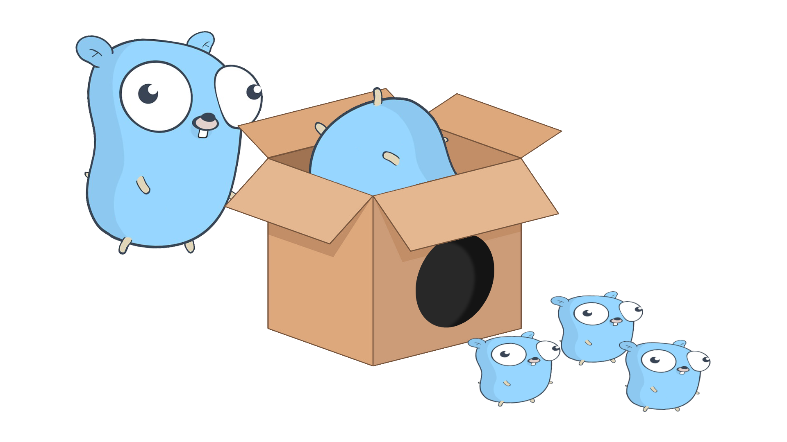
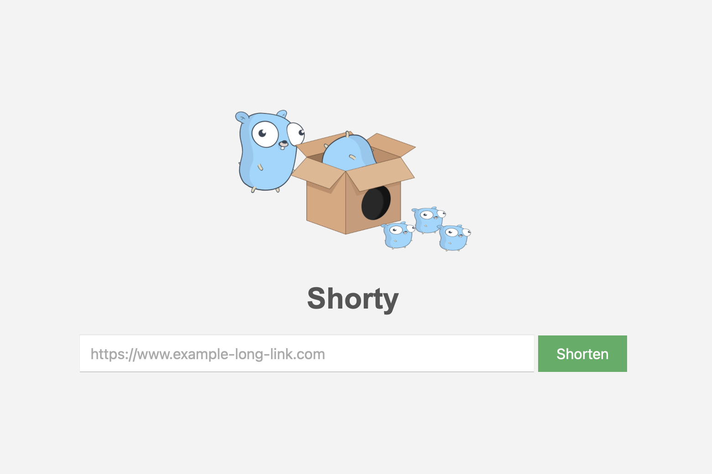

    

# shorty

URL shortener API in GoLang programming language, using Gin-Gonic web framework and Redis (REmote DIctionary Server), an open source, in-memory, key-value (NoSQL) data structure store useful for API request, in this case used as primary quick-response database and application cache.

## preview

